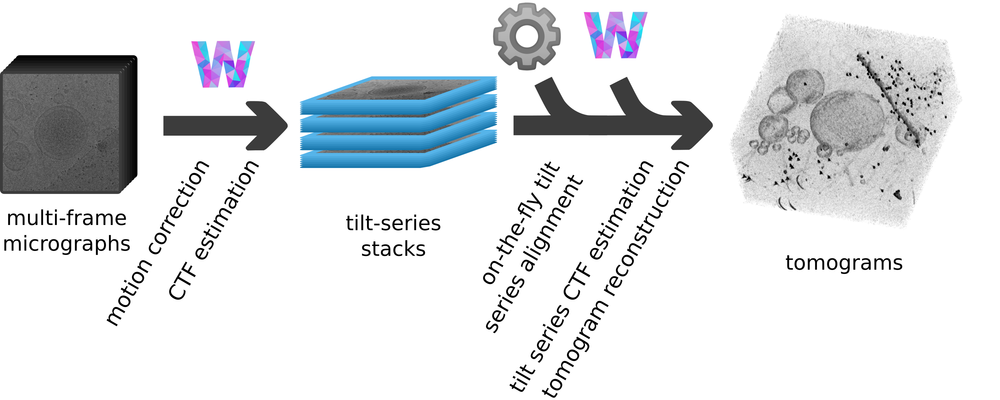
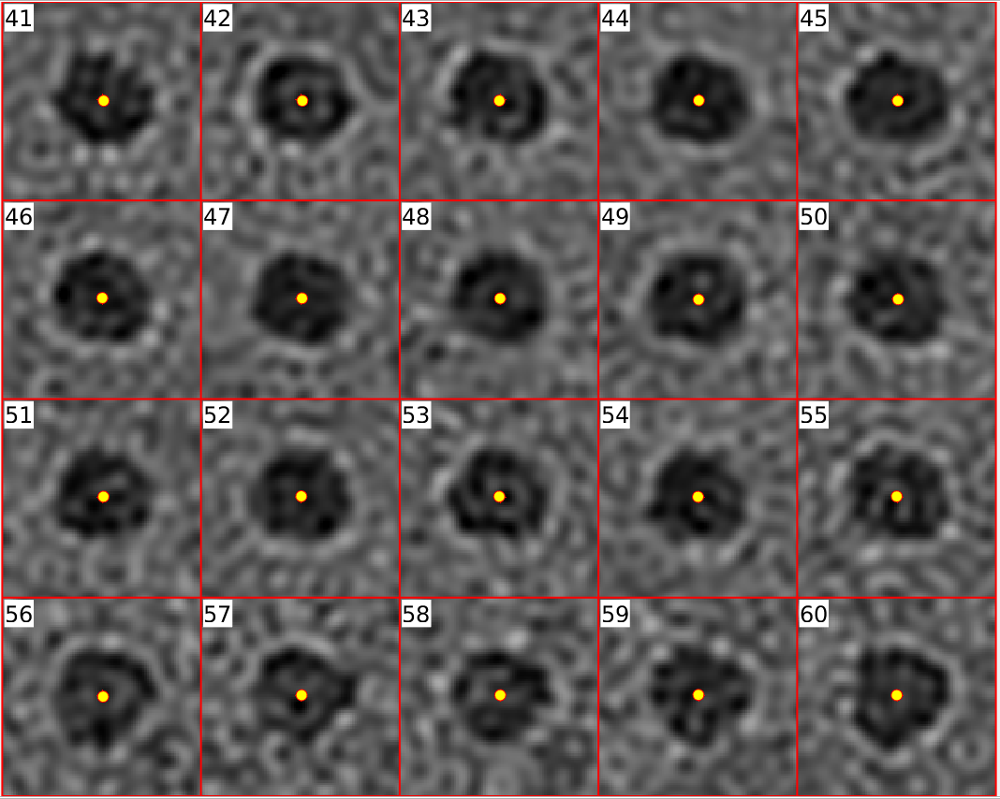

## Automated on-the-fly fiducial-based tilt-series alignment for Warp tilt-series directories
<p align="center">    
     
</p>

#### Workflow from raw data to aligned tilt-series
1. Follow the  <a href="http://www.warpem.com/warp/?page_id=378">Warp user guide</a> to take you from frames to tilt-series
2. Run `dautoalign4warp`, it will watch your tilt-series directory (`imod`) and align any incoming tilt-series
3. Import the results into warp and reconstruct your tomograms!
4. (optional) Use `warp2catalogue` to easily create a Dynamo catalogue for particle picking

#### Motivation
- Robust, automated tilt-series alignment of stacks created by Warp
- Ability to easily use Warp reconstructions with the geometrical particle picking tools in Dynamo

#### Outline
- Automated robust fiducial detection and fiducial position refinement using Dynamo

 <p align="center">    
     
</p>

- Creation of an IMOD model from these positions
- Tilt-series alignment using the IMOD program tiltalign (fixed tilt angles, solve for one rotation angle)
- Preparation of all results for easy import back into Warp

#### Particle picking in Dynamo?
Do you want to use the <a href="https://wiki.dynamo.biozentrum.unibas.ch/w/index.php/Model">geometrical tools</a> in Dynamo to pick particles, imparting prior knowledge about your particle orientation to further subtomogram averaging?

 <p align="center">    
     
</p>

If so, you may want to use the `warp2catalogue` function to quickly set up a <a href="https://wiki.dynamo.biozentrum.unibas.ch/w/index.php/Catalogue">catalogue</a> of your data, correctly linked for visualisation of Warp's deconvolved tomograms with cropping directly from the 3d-CTF corrected tomogram from warp


#### Installation
#### Requirements
- Dynamo (1.1.478 or later) activated in MATLAB
- IMOD (tested on 4.10.35)
- MATLAB (R2019a or later)
- Python (3.0 or later)

#### Download and install
```bash
git clone https://github.com/alisterburt/autoalign_dynamo.git
cd autoalign_dynamo
./install.sh
```

This requires git, which can be installed by your package manager if not already present in your system, for example...
```bash
sudo apt-get install git
```

You will be asked where you would like to install the package, the default location is...
```bash
/opt/autoalign_dynamo
```

After installation you can remove the installation files
```bash
cd ..
rm -r autoalign_dynamo
```

#### Activation and Running
1. Make sure Dynamo is activated in MATLAB (`dynamo_activate`)
2. Activate autoalign_dynamo (`run /path/to/install/autoalign_activate.m`)
3. run `dautoalign4warp(<warp_tilt_series_directory>, <pixel_size_angstrom>, <fiducial_diameter_nm>, <nominal_rotation_angle>, <output_folder>)`

This will watch the warp tilt-series directory, align your tilt-series on-the-fly and tidy everything up ready for import back into Warp so you can generate your tomograms.

If you then want to use Dynamo for particle picking...

4. Import alignments into Warp as described in Warp's user guide
5. Reconstruct downsampled tomograms (and deconvolved tomograms for visualisation) in Warp
6. Run `warp2catalogue(<warp_reconstruction_folder>, <pixel_size_angstrom>)`

This will generate a catalogue in which the visualisation volume is the deconvolved tomogram from Warp, particles will be cropped from the 3D-CTF corrected, unfiltered reconstructions

To look at this catalogue, in MATLAB type...
```
dcm warp_catalogue
```

#### Additional info
If you want to use the automated alignment script outside of the Warp directory structure, a function called align is provided which allows automated alignment of a single tilt-series.

Enjoy!
