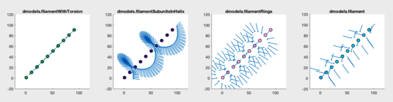

# Workflow to prep data for M
1. Follow the  <a href="http://www.warpem.com/warp/?page_id=378">Warp user guide</a> to take you from frames to tilt-series
2. Navigate to the 'imod' directory warp created and run 
`dautoalign4warp(apix, fiducial_diameter_nm, nominal_rotation_angle, output_folder)`
3. Import the results into warp and generate your tomograms!

dautoalign4warp is a function for...
- Automated fiducial detection and recentering based on 2D average of bead across tilt series using Dynamo
 
    
     

- Creation of an IMOD model from these bead positions
- Tilt series alignment using the IMOD program tiltalign (fixed tilt angles, solve for one rotation angle)
- Preparation of all results for easy import back into Warp

Do you want to use the <a href="https://wiki.dynamo.biozentrum.unibas.ch/w/index.php/Model">geometrical tools</a> in Dynamo to pick particles, imparting prior knowledge about your particle orientation to further subtomogram averaging?

 
    
     

If so, ou may want to use the `warp2catalogue` script to quickly set up a <a href="https://wiki.dynamo.biozentrum.unibas.ch/w/index.php/Catalogue">catalogue</a> of your data, correctly linked for visualisation of Warp's deconvolved tomograms with cropping directly from the 3d-CTF corrected tomogram from warp

